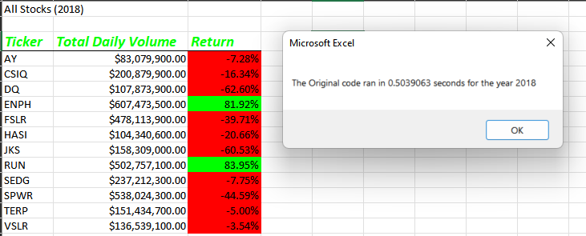

# Refactoring with VBA

## Overview of Project

### Purpose
The goal of this project is to evaluate our results using two separate script methodologies.  In both outcomes we will be seeking a Stock output report that includes the Stock Ticker, Total Daily Volume, and the Return for each year.  The goal is to create a refactored script that runs more efficiently vs the original, and to assist in analyzing the results we will include code to track how long each script takes to run from start to finish.  Our final recommendation will allow our client (Steve) to run future analysis most efficiently and will assist him in determining what Stock investments are best for his clients.

## Results

### Refactoring the Code - Key Steps
A few of the components that required modification included the following:
- [ ] Creation of a ticker Index
- [ ] Creation of three output arrays for tickerVolumes, tickerStartingPrices, and tickerEndingPrices
- [ ] Using **FOR** to loop thru the stock data; reading and storing all of the values from each row

**To view the key components refactored code select below link:**
![Refactoredcode.png]

### Analysis of Original Code vs Refactored Code - 2017 
Refactoring the original code yielded an improvement of **.4179688 seconds**

*2017 Original code:*

*2017 Refactored code:*

### Analysis of Original Code vs Refactored Code - 2018 
Refactoring the original code yielded an improvement of **.4101563 seconds**

*2018 Original code:*

*2018 Refactored code:*

## Summary

### Advantages and Disadvantages of Refactoring Code in general
Advantages of Refactored Code
- Script is capable of running larger data sets in a shorter amount of time
- To some end users; code may appear more straightforward and easier to read

Disadvantages of Refactored Code
- Script may be more lengthy
- There is no guarantee that the script will run faster
- Script may require some trial and error
 
### Advantages and Disadvantages of the Original and Refactored VBA script
Advantages of Refactored Code vs Original
- There was overall improvement in script run time

Disadvantages of Refactored Code vs Original
- Code was more complicated; required more research and comprehension to fix coding issues